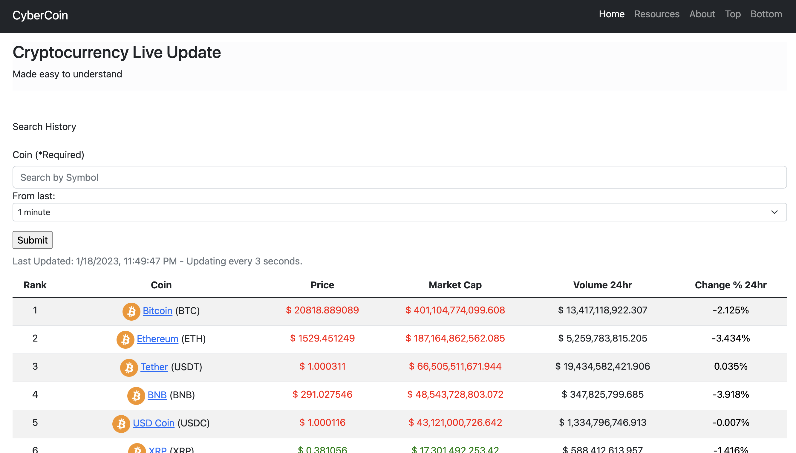
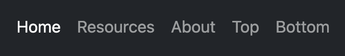
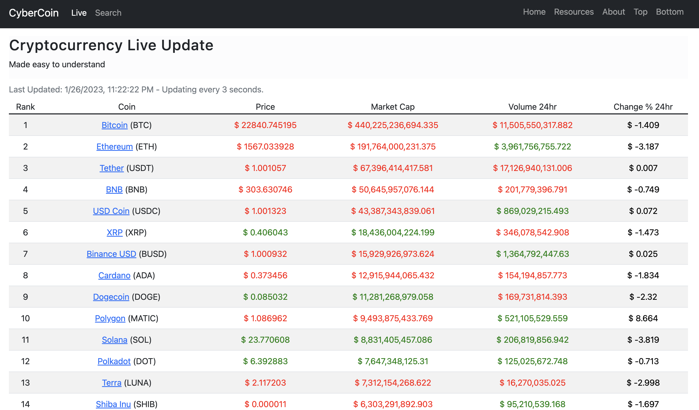

<h1>CyberCoin-Project</h1>

My 1st Front-end Portfolio Project from Pursuit 9.4 Class Module 2. 
A website where you can see the live updates of Cryptocurrencies datas.

 

---
<h2>How it works</h2>

<figure>
    
    <figcaption>The main home page.</figcaption>
</figure>

The code is set up to run every 3 seconds. 

On the top of the page, you can see the navigation bar. 
<figure>
    
    <figcaption>The navigation bar on the right top corner.</figcaption>
</figure>

<strong>Home</strong> - Go to the main page. 
<strong>Resource</strong> - Website's data informations, such as API, Bootstrap, etc. 
<strong>About</strong> - Short biography of Me and the link to my GitHub as well as this project repository. 
<strong>Top</strong> - To go to the top of the page. 
<strong>Bottom</strong> - To go to the bottom of the page. 

And in the center of the page, you can see the Crypto Live Update table, updating every 3 seconds as stated above. 
<figure>
    
    <figcaption>The data table.</figcaption>
</figure>

It's organized by its <em>Ranking number</em>, <em>Coin name</em>, <em>current Price</em>, <em>Market Cap</em>, <em>Volume in 24hrs</em> and <em>Change Percentage in 24hrs</em>. <strong>All in USD</strong> 
It changes the color. To BLACK if the price remains the same, to GREEN if the price went up, and to RED if the price went down from previos to current value.

 

And sometimes you will see the numbers turning to Red or Green even though it looks like there's no change on the price. That is because the api data that it's been given to us, it gives us the number with <em><strong>18 Decimals Numbers</strong></em>!

---
<h2>Features that I'm currently working on</h2>
<ul>
    <li>make a home page welcoming the users, make a separate page for "live view" and "search result"</li>
    <li>make "live" and "search" bottom on the top in the navigation bar on the right side of the "CyberCoin", so it can redirect to a new page accordingly.</li>
    <li>add a function to show more details about the coin when the user clicks on the table row.</li>
    <li>get all the images of the each cryptocurrencies and display it successfully besides of its name. (Currently I have few images, but still working on how to filter through the images on the local folder with the value that I get from the user, and then finally display it.)</li>
    <li>improve the style of the pages.</li>
    <li>have pagination on the bottom of the main page, so it doesn't show all top 100 raking crypto, but only about 25 of them, then the rest redirect to the next pages.</li>
    <li>etc.</li>
</ul>
 
---
<h2>Ideas for Future Implementations</h2>
<ul>
    <li>Implement the user's registrations system.</li>
    <li>Add "my favorites" page, so the user can quickly view the one's that it's interested.</li>
    <li>etc.</li>
</ul>
 
---