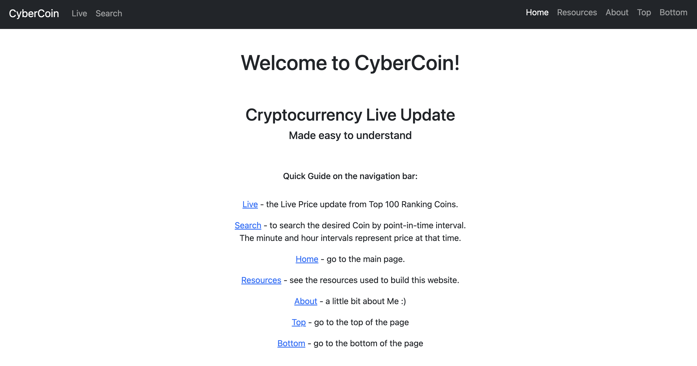

<h1>CyberCoin-Project</h1>

My 1st Front-end Portfolio Project from Pursuit 9.4 Class Module 2. 
A website where you can see the live updates of Cryptocurrencies datas.

 

My website deployed on Netlify: <a href="https://cybercoin-project.netlify.app/" target="_blank" rel="noopener noreferrer">https://cybercoin-project.netlify.app/</a>

 

<h2>How it works</h2>
<figure>
    <figcaption>The main home page.</figcaption>
    
</figure>

On the top of the page, you can see the navigation bar.

 
<figure>
    <figcaption>The navigation bar on the left top corner.</figcaption>
    
</figure>
<figure>
    <figcaption>The navigation bar on the right top corner.</figcaption>
    
</figure>
<ul>
    <li><strong>CyberCoin</strong> - To the main page. </li>
    <li><strong>Live</strong> - Shows the top 100 ranking coins live price update page. </li>
    <li><strong>Search</strong> - To searh and view the chart of the desired coin. </li>
    <li><strong>Home</strong> - To the main page. </li>
    <li><strong>Resource</strong> - Website's data informations, such as API, Bootstrap, etc. </li>
    <li><strong>About</strong> - Short biography of Me and the link to my GitHub as well as this project repository. </li>
    <li><strong>Top</strong> - Go to the top of the page. </li>
    <li><strong>Bottom</strong> - Go to the bottom of the page. </li>
</ul>
 

And in the center of the page, you can see the "Quick Guide on the navigation bar".

 

<h2>Live</h2>

The code is set up to run every 3 seconds. 
<figure>
    <figcaption>The data table.</figcaption>
    
</figure>

It's organized by its <em>Ranking number</em>, <em>Coin name</em>, <em>current Price</em>, <em>Market Cap</em>, <em>Volume in 24hrs</em> and <em>Change Percentage in 24hrs</em>. <strong>All in USD</strong> 
It changes the color. To BLACK if the price remains the same, to GREEN if the price went up, and to RED if the price went down from previos to current value.

 

And sometimes you will see the numbers turning to Red or Green even though it looks like there's no change on the price. That is because the api data that it's been given to us, it gives us the number with <em><strong>18 Decimals Numbers</strong></em>!

 

<h2>Search</h2>

In the beginning it's empty since nothing was searched.

<figure>
    <figcaption>Showing empty search.</figcaption>
    
</figure>
 

Then, when you search it, it logs the chart from top to bottom, meaning the second search it will be on the bottom of the first one.
 
And it logs up to 5 charts. If you search it more then five, it will erase the first chart on the list and add the new one on the bottom.

<figure>
    <figcaption>The search result showing charts (zoomed out to view a few charts).</figcaption>
    
</figure>
 

<h2>Ideas for Future Implementations</h2>
<ul>
    <li>Add the pagination on the bottom to list the table view up to 25 rows.</li>
    <li>Add a function to show more details about the coin when the user clicks on the table row.</li>
    <li>Get the images of the each cryptocurrencies and display it successfully besides of its name.</li>
    <li>Add "favorite" icon, so the user can quickly view the one's that it's interested.</li>
    <li>Add a feature to compare prices between coins.</li>
    <li>etc.</li>
</ul>
 